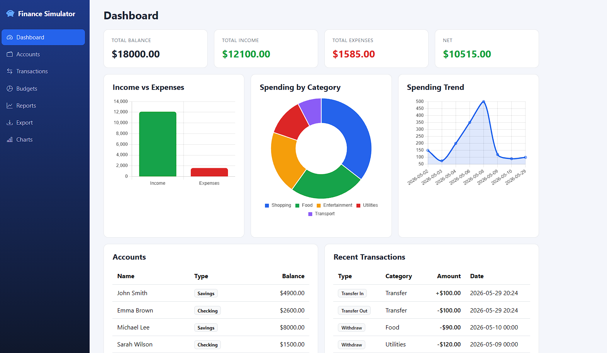
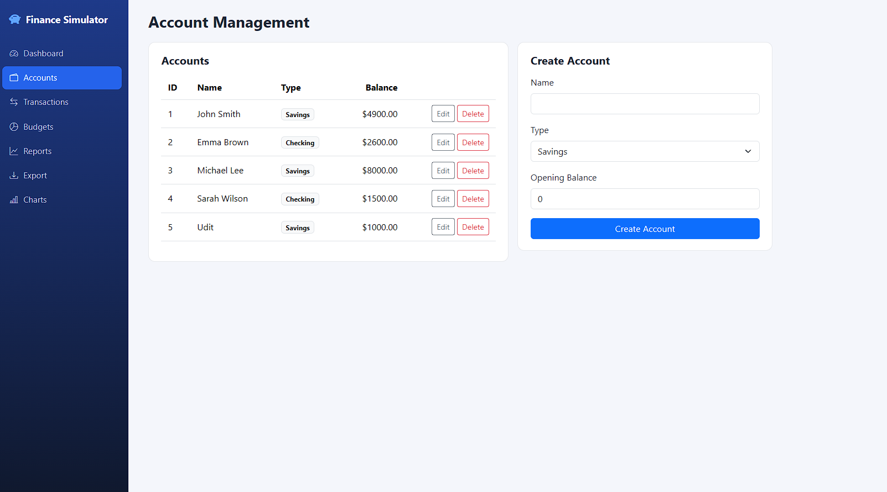
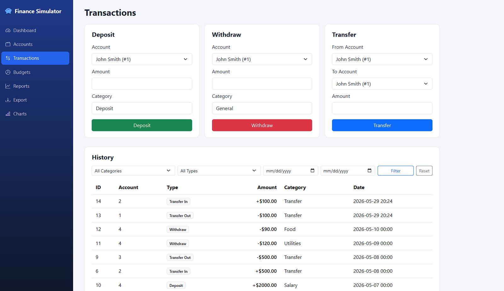
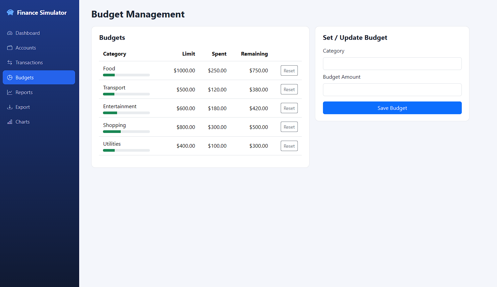
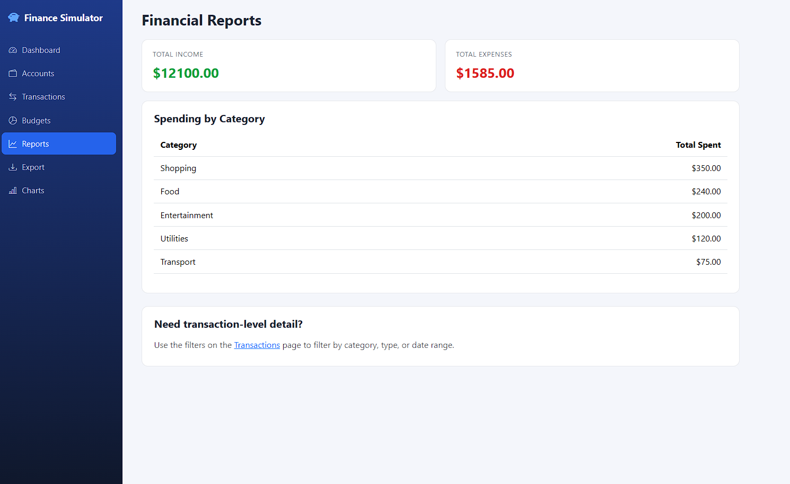
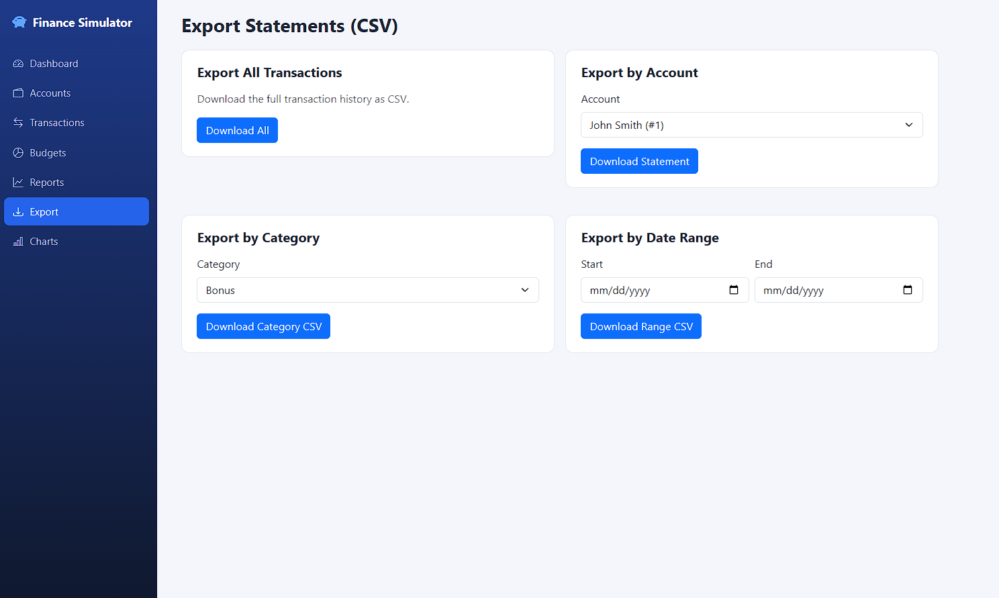
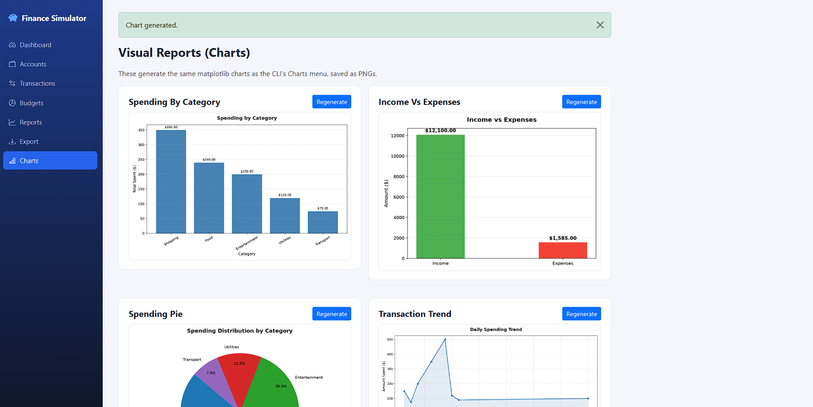

# 💰 Personal Finance Simulator

A Personal Finance Management System built with **Python**, **Flask**, and **PostgreSQL** — featuring a polished web dashboard UI and the original CLI mode, designed to manage accounts, transactions, budgets, reports, exports, and visual analytics.


---

## 👤 Author

| Field | Details |
|---|---|
| **Name** | Udit Bansal |
| **Student ID** | 560290619 |
| **Tutorial** | 26 |
| **Tutor** | Niousha Nazemi |

---

## 📋 Overview

Personal Finance Simulator simulates real-world personal finance management end to end: account management, deposits/withdrawals/transfers, category budgets with overspend warnings, income/expense reporting, CSV statement exports, and chart-based visual analytics — all backed by a PostgreSQL database.

It ships with **two interfaces** over the same database:

- **Web UI** (`app.py`) — a Flask app with a clean, dashboard-style interface: sidebar navigation, live stat cards, Chart.js analytics, inline account/budget management, transaction filtering, and one-click CSV/PNG downloads.
- **CLI** (`main.py`) — the original terminal-based menu system, kept fully functional and untouched.

---

## 🎯 Objectives

1. Build a fully functional personal finance system with both a CLI and a web interface
2. Implement database operations using PostgreSQL
3. Apply programming concepts (functions, conditionals, loops, modular design)
4. Simulate real-world personal finance workflows (accounts, budgets, transactions, reporting)
5. Ensure efficient and structured data handling using parameterised queries

---

## 🛠️ Technologies Used

| Technology | Purpose |
|---|---|
| Python | Core programming language |
| Flask | Web framework powering the dashboard UI |
| Jinja2 + Bootstrap 5 | Server-rendered templates and styling |
| Chart.js | Interactive analytics charts in the browser |
| PostgreSQL | Persistent data storage |
| psycopg2 | Python–PostgreSQL database connector |
| matplotlib | Chart and graph generation (PNG exports) |
| csv (stdlib) | CSV export functionality |

---

## 📁 Project Structure

```
Personal-Finance-Simulator/
│
├── app.py             # Flask web app — routes, dashboard, chart data API
├── main.py            # CLI entry point — terminal main menu
├── web_data.py         # Data-access layer for the web UI (returns data, not print())
├── database.py         # Database connection setup (psycopg2)
├── accounts.py         # Account creation, update, delete, view (CLI)
├── transactions.py     # Deposit, withdraw, transfer, view history (CLI)
├── budgets.py           # Set, track, reset category budgets (CLI)
├── reports.py           # Income/expense summaries and filters (CLI)
├── exports.py            # CSV export by account, date, category
├── charts.py              # Matplotlib chart generation
├── SQL_Stmts.sql          # Table creation scripts
├── templates/             # Flask/Jinja2 HTML templates
│   └── base.html, dashboard.html, accounts.html, ...
├── static/
│   ├── css/style.css      # Dashboard styling
│   └── charts/            # Generated chart PNGs
├── Screenshots/           # UI screenshots used in this README
└── requirements.txt
```

---

## ✨ Features

### 📊 Web Dashboard (`app.py`)
- Live stat cards: total balance, total income, total expenses, net position
- Interactive Chart.js charts: income vs expenses, spending by category, spending trend
- Account balances, recent transactions, and budget progress bars at a glance



### 💼 Account Management
- Create accounts (Savings/Checking) with an opening balance
- Inline edit name/type via modal; delete an account (cascades its transactions)



### 🔁 Transactions
- Deposit, withdraw, and transfer funds between accounts
- Automatic balance validation (insufficient balance protection)
- Filterable transaction history by category, type, and date range



### 🎯 Budget Management
- Set or update a spending limit per category
- Visual progress bars with an "Exceeded" badge when a category goes over budget
- Reset spent amount per category



### 📑 Financial Reports
- Income summary, expense summary, and spending-by-category breakdown



### 📤 Export Statements
- One-click CSV export: all transactions, by account, by category, by date range



### 📈 Visual Reports (Charts)
- Generate matplotlib PNG charts: spending by category, income vs expenses, spending distribution (pie), daily spending trend, budget vs spent
- Regenerate on demand from the latest data



*(The original CLI mode in `main.py` offers the equivalent menu-driven version of every feature above.)*

---

## ⚙️ Setup & Installation

### Prerequisites
- Python 3.8+
- PostgreSQL database access
- pip

### 1. Clone and install dependencies

```bash
git clone <your-repo-url>
cd Personal-Finance-Simulator
pip install -r requirements.txt
```

> Note: if you're on a very new Python version (3.13+) and `psycopg2-binary` fails to build, install it explicitly with:
> `pip install psycopg2-binary --only-binary=:all:`

### 2. Configure your database connection

Edit `database.py` to point to your PostgreSQL instance:

```python
def connect_db():
    conn = psycopg2.connect(
        host="your-db-host",
        database="your-database-name",
        user="your-username",
        password="your-password"
    )
    return conn
```

### 3. Create the database tables

Run `SQL_Stmts.sql` against your PostgreSQL database:

```bash
psql -h <host> -U <user> -d <database> -f SQL_Stmts.sql
```

### 4. Run the app

**Web UI:**
```bash
python app.py
```
Then open **http://127.0.0.1:5000**.

**CLI:**
```bash
python main.py
```

---

## 🖥️ CLI Main Menu

```
====== Personal Finance Simulator ======
1. Account Management
2. Transactions
3. Budget Management
4. Reports
5. Export Statements (CSV)
6. Visual Reports (Charts)
7. Exit
```

---

## 🔄 System Flow

```
Start
  └─> Connect to Database
        └─> Web UI: navigate via sidebar  |  CLI: display main menu
              └─> Select feature
                    └─> Read/write data via parameterised SQL
                          └─> Render dashboard / print result
```

---

## 🔒 Security Notes

- All SQL uses parameterised queries (`%s` placeholders) to prevent SQL injection
- Each account deletion cascades and removes its associated transactions
- Move `database.py` credentials to environment variables before sharing or deploying this project publicly

---

## 📌 Notes

- All monetary values use USD ($) format
- Withdrawals check for sufficient balance before processing
- Budget warnings trigger automatically once spending exceeds the set limit
- CSV exports download directly through the browser in the web UI, or save to the working directory in CLI mode
- Charts are saved as `.png` files at 150 DPI using matplotlib

---

## 📄 License

This project was created for academic purposes as part of a university coursework assignment.
